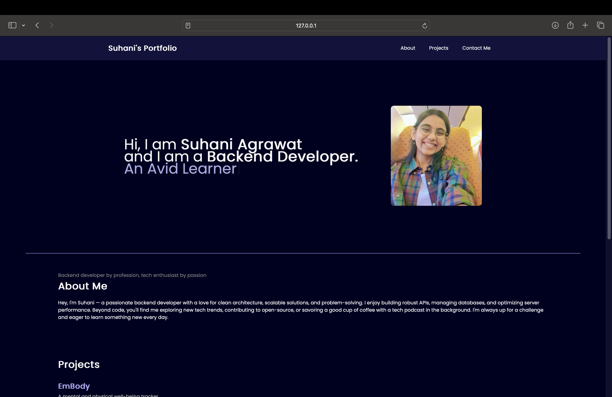
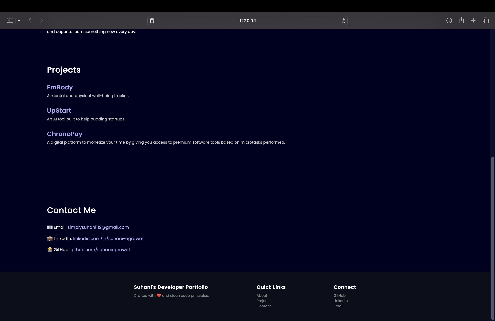

# Personal Developer Portfolio Landing Page

A simple and clean personal portfolio landing page built using **HTML** and **vanilla CSS**. This website introduces who I am, showcases my key projects, and provides contact information for collaboration opportunities.I primarily specialize in backend development, and this project marks my first attempt at frontend development. To focus on core concepts, I chose to build it primarily using HTML and vanilla CSS.

---

## Features

- Responsive and modern UI  
- About Me section  
- Projects showcase  
- Contact information with email and social links  
- Smooth scrolling navigation  
- Custom styling with vanilla CSS  
- Animated typing effect using **Typed.js**

---

### Homepage View



### Projects Section View




---

## Technologies Used

- **HTML5**
- **Vanilla CSS**
- **Typed.js** (for typing animation)

---


## How to Use

1. Clone the repository:
   ```bash
   git clone https://github.com/suhaniagrawat/Personal-Portfolio-Landing-Page.git


2. open index.html file in your browser.
